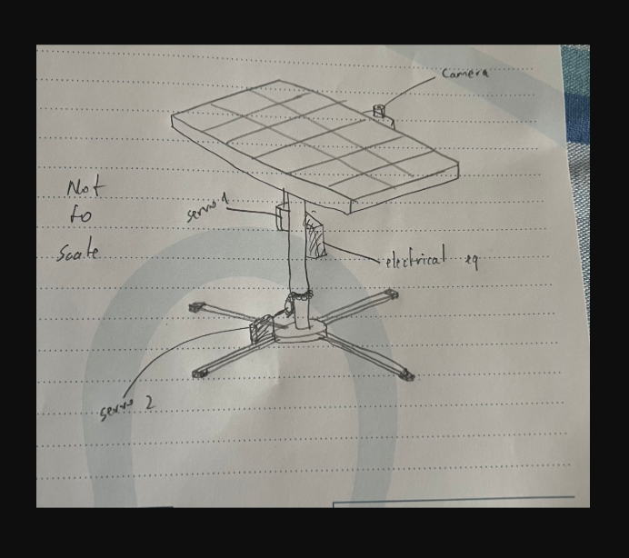

# AI Solar Panel

## Project Overview

This repository contains the deep learning component of an innovative self-adjusting solar panel system. Our project aims to maximize solar energy absorption by accurately tracking the sun's position using computer vision and deep learning techniques.

## Key Features

- **Sun Position Detection**: Utilizes YOLOv5 and MobileNet models for real-time sun detection in camera feed.
- **Coordinate Processing**: Analyzes detected sun positions to determine optimal panel alignment.
- **Microcontroller Integration**: Designed to run efficiently on microcontroller hardware.
- **Automated Adjustment**: Provides coordinates to guide the solar panel's orientation for maximum sunlight exposure.

## System Architecture

The system operates as follows:
1. Camera captures images of the sky
2. Deep learning model detects the sun's position
3. Coordinates are processed to determine optimal panel alignment
4. Microcontroller receives coordinates and adjusts panel orientation

## Technical Details

- **Models**: YOLOv5 and MobileNet
- **Target Hardware**: Microcontroller (specific model TBD)
- **Calibration**: Central square in camera view serves as reference point
- **Output**: Closest coordinates between sun and camera center

## Project Goals

1. Develop an accurate and efficient sun-tracking algorithm
2. Optimize models for microcontroller deployment
3. Integrate seamlessly with the electrical components of the solar panel system

## Setup

We're using WSL 2.0 (Ubuntu 24) with tensorflow-gpu.

1. Install all requirements
2. run the main python file
3. Boom!

## Contributing

We welcome contributions to improve the AI component of our solar panel system. Please refer to our contributing guidelines for more information.

## Contact

For questions or collaboration inquiries, please contact ME!